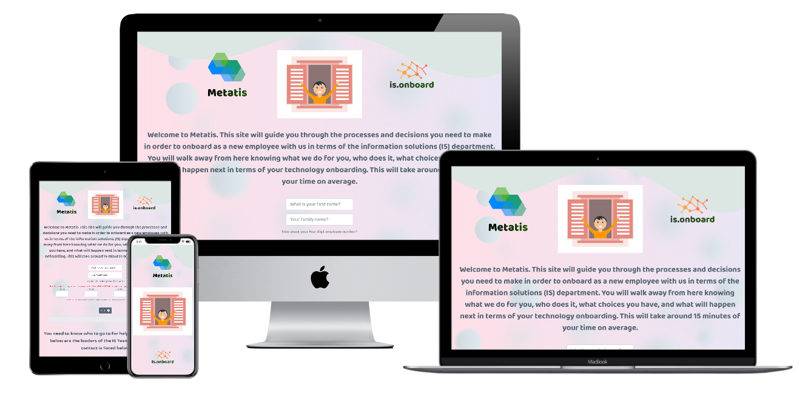

<div align="center">

</div>

<div align="center">

</div>

---

# is.onboard

---

## Aim of the site

This is a site that is used to on-board new employees of a (fictional) company. It is specifically focussed on the Information Systems (IS) department, and the new employee's 
relationship and induction with the IS function. It allows them to walk away from the experience with an understanding of how IS works for **them**, and what equipment choices they have to make that are relevant to their role. 

**Link to live site:** https://stuartcox3107.github.io/is.onboard/ (opens in same tab, click back if needed)

---

## User stories

"As a new employee: I want to walk away from this interaction with the feeling that the company and the IS department are professional and have provided me with 
an online induction tailored towards **my** needs and the needs of my role. I want the experience to be quick and simple and to give me all the information **I** need to make the relevant choices to 
do my job effectively. I want to understand what the next steps are in terms of me starting my new role and how IS fits in with this."

"As a manager in the IS department: I want to be certain that the new employee is being offered the right equipment for their role but can make choices that tailor the choice to their own preferences. 
I want to know that they have a good understanding of 
the point of contact relevant to **their** new role should they have any issues. I want them to walk away from the experience knowing exactly what the next steps are."

"As a senior manager in the company: I want to be certain that my new employees are engaged with the company from the start, and that they do not waste valuable 
time after actually starting their roles in working through what equipment they actually need to perform their role. I want to be sure that they have choices available to them 
that meet the needs of their role, their own personal preferences, and also within the boundaries of the purchasing cost restraints"

"As a supply chain manager: I want to be confident that all new starters are receiving products that are from our nominated suppliers"

---

## Site features & wireframes

### View 1

This will give a basic introduction of what the site will achieve, ask for their name and employee number. A next button only will also be present.

- [View 1 desktop & tablet](wireframes/p1desktoptablet.png) opens in same tab, press back to return
- [View 1 mobile](wireframes/p1mobile.png) opens in same tab, press back to return

### View 2

This will tell them the generic structure of the IS management team and also the IS contact specific to their department. A next button will also be present.

- [View 2 desktop & tablet](wireframes/p2desktoptablet.png) opens in same tab, press back to return
- [View 2 mobile](wireframes/p2mobile.png) opens in same tab, press back to return

### View 3

This will give them a choice of laptops to choose from, specific to their new role. A next button will also be present.

- [View 3 desktop & tablet](wireframes/p3desktoptablet.png) opens in same tab, press back to return
- [View 3 mobile](wireframes/p3mobile.png) opens in same tab, press back to return

### View 4

This will take their laptop choice and present the relevant choices for a case. A next button will also be present.

- [View 4 desktop & tablet](wireframes/p4desktoptablet.png) opens in same tab, press back to return
- [View 4 mobile](wireframes/p4mobile.png) opens in same tab, press back to return

### View 5

This will take their department and laptop choices and give options for a screen. A next button will also be present.

- [View 5 desktop & tablet](wireframes/p5desktoptablet.png) opens in same tab, press back to return
- [View 5 mobile](wireframes/p5mobile.png) opens in same tab, press back to return

### View 6

This will tell them what the next steps are and confirm the information entered.

- [View 6 desktop & tablet](wireframes/p6desktoptablet.png) opens in same tab, press back to return
- [View 6 mobile](wireframes/p6mobile.png) opens in same tab, press back to return

---

## Theme & typography

The site will be a single page site with 6 different views, the first view will gather the name and employee number of the new starter and the 
views following this will change according to which department the employee will be working in, or from previous choices made by them. If for example they work in the 
marketing department they will be presented with the option of laptop A or laptop B, if they choose laptop B then they will be presented with the relevant sized laptop case options.
Navigation will purely be through NEXT buttons. 

Given the target users are new employees, the site needs to be professional in terms of style & look to convey the feeling of professionalism.
The company would want to present itself as slick and professional, and the site should convey this. It should be very simple to use and need few instructions for use.

- Linear navigation, one step at a time using only "NEXT" to progress
- Simple, quick, intuitive. Asks exactly what is needed only
- Questions and display is based on either the department of the new employee or previous equipment choices made
- Overview of choices needed to be made with links present to further details if needed
- Simple pages, no information overload

---

## Features left to implement

- Not in the scope of this project, but future plans would be to automate follow up emails on progress
- Not in the scope of this project, but future plans would be to link this to inductions of all divisions of the company
- All relevant choices will be stored at the final page in variables. On a live site these would be sent as an email to the IS team, but in this case are console logged

---

## Technologies Used & credits

- HTML, CSS & Javascript
- [JQuery](https://jquery.com) Javascript library, opens in same tab, press back to return
- [Fontawesome](https://fontawesome.com/) for back & next arrows used through all pages, opens in same tab, press back to return
- [Hover.css](https://ianlunn.github.io/Hover/) for back & forward button effects, opens in same tab, press back to return
- [Google fonts](https://fonts.google.com/) for Baloo Thambo 2 font used through all pages, opens in same tab, press back to return
- [Favicon.io](https://favicon.io/) to generate favicon,opens in same tab, press back to return
- [Bootstrap](https://getbootstrap.com/)  for layout framework, opens in same tab, press back to return
- [Gitpod](https://www.gitpod.io/)  IDE used to code, opens in same tab, press back to return
- [GitHub](https://github.com/)  To host the repositories for this project and the live website preview, opens in same tab, press back to return
- [Balsamiq](https://balsamiq.com/)  used to design wireframes, opens in same tab, press back to return
- [https://background-generator.com/]  used to generate background vector
- [https://undraw.co/illustrations]  used for cartoon image on site
- [https://www.shapedivider.app/] used to generate the site wavy shape divider

---

## Testing

### General

All views tested for various devices using Chrome Developer tools: Moto G4, Galaxy S5, Pixel 2, Pixel 2XL, iPhone 5 SE, iPhone 6/7/8, iPhone 6/7/8 Plus, iPhone X, iPad, iPad Pro, Galaxy Fold, Surface Duo

Live site tested on Chrome, IE, Firefox, Edge

### HTML

- Code ran through [W3C HTML markup validation service](https://validator.w3.org/#validate_by_uri) opens in same tab, press back to return. Passed with no errors or warnings.

### CSS

- Code ran through [W3S CSS markup validation service](https://jigsaw.w3.org/css-validator/) opens in same tab, press back to return. Passed with no errors or warnings.

### Javascript

### Page 1

- Manually tested number inputs to check that letters and only whole numbers between 1 and 5 are accepted
- Console log prints the staff number digits, and that the length is 4 digits long 

### Page 2

- Manually tested to check that all variations of the first digit of the staff number display the correct contact person, number and emails

### Page 3

- Manually tested to check that each of the 5 possible employee departments display the correct introduction text
- Manually tested to check that each of the 5 possible employee departments display the correct laptop choices and features
- Manually checked to ensure that one (not zero or 2) laptops can be chosen in order to move to the next view
- Console log prints the laptop choice selected
- Manually tested to check that all laptop links work

### Page 4 

- Manually tested with all latop possibilities that the correct text is displayed
- Console log prints the bag choice selected

### Page 5

- Manually tested screen "Want to know more" links
- Manually tested all department, laptop and bag previous choices display the correct text
- Console log prints bag choice made

### Page 6

- Console log prints all choices made to ensure that the appropriate variables are still stored
- Manually tested to ensure that all previous choices display the correct final page text


---

## Deployment

To deploy this page to GitHub Pages from its [GitHub repository]<!--(xxxxxxxxxxxxxxxxxxxxxxxxxxxxx)-->, the following steps were taken: 

1. From the menu items near the top of the page, select **Settings**.
2. Scroll down to the **GitHub Pages** section.
3. Under **Source** click the drop-down menu labelled **None** and select **Master Branch**
4. On selecting Master Branch the page is automatically refreshed, the website is now deployed. 
5. Scroll back down to the **GitHub Pages** section to retrieve the link to the deployed website.
 

### How to run this project locally

To clone this project from GitHub:

1. Under the repository name, click "Clone or download".
2. In the Clone with HTTPs section, copy the clone URL for the repository. 
3. In your local IDE open Git Bash.
4. Change the current working directory to the location where you want the cloned directory to be made.
5. Type ```git clone```, and then paste the URL you copied in Step 3.
```console
git clone https://github.com/StuartCox3107/is.onboard.git
```
6. Press Enter. Your local clone will be created.

Further reading and troubleshooting on cloning a repository from GitHub [here](https://help.github.com/en/articles/cloning-a-repository).

---

### Credits & acknowledgements

- [Simen Daehlin](https://github.com/Eventyret) - [The Padwan Project](https://github.com/Eventyret/Padawan) for boilerplate template
- Richard Wells_lead for the README.md Deployment section

---